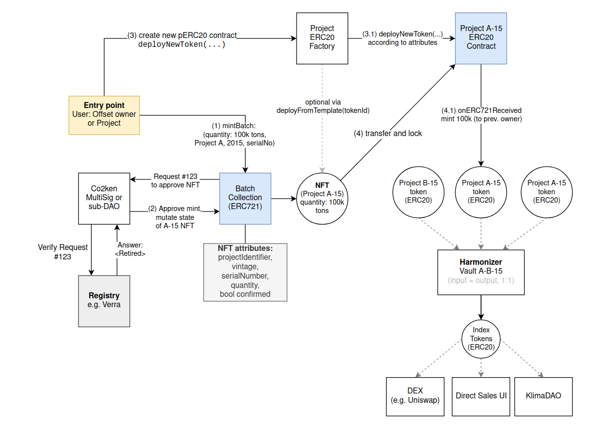

# Co2ken
We're building a protocol that allows anybody to bring carbon credits on-chain via tokenization, directly sell or aggregate them in carbon index pools.
We want to bring carbon as an asset class to DeFi and unlock the myriad possibilities for its integration into decentralized products.
# Tokenizer MVP
We are building an MVP for the tokenization of legacy (real-world) carbon credits. 

## Architecture overview
The image below depicts a simplified version of the tokenization system.
The entry point is a user that wants to tokenize their carbon offset credits.
The project NFTs that contain meta data about offsetting projects are not depicted in this diagram for simplification purposes.


# Stack
## Built with Scaffold-ETH

- Frontend: react
- Hardhat/ethers/solidity

# 🏃‍♀️ Local deployment

required: [Node](https://nodejs.org/dist/latest-v12.x/) plus [Yarn](https://classic.yarnpkg.com/en/docs/install/) and [Git](https://git-scm.com/downloads)

For local deployment and test you need three terminal windows:

> 1st window:
```bash
yarn install
yarn chain
```

> in a second terminal window:

```bash
yarn start
```
> in a third terminal window:

```bash
yarn deploy
```

📱 Open http://localhost:3000 to see the app

# Deployment on Kovan
Generate new secret phrase (mnemonic)
`yarn run generate`

Display the current account (you can check if you have some ETH or testnet ETH inside it)
`yarn run account`

Deploy the contracts to Kovan (and execute other transactions specified in the deploy script)
`yarn deploy --network kovan`

# Testing
```
cd packages/hardhat
yarn run test
```

